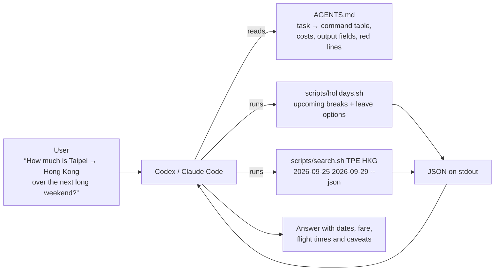

# flight-price-monitor

**English** · [繁體中文](README.zh-TW.md)

A local-first tool that answers one question for travellers in Taiwan: **for the next public holiday, where is it cheapest to fly nonstop — and is it worth taking a day of leave?**

It reads Taiwan's official government office calendar to find upcoming long weekends, works out the leave options around each one, and compares live nonstop fares to popular destinations. It runs entirely on your own computer: no account, no API key, and your data never leaves your machine.

It is built to be driven two ways: by a person through a local web page, or by a **coding agent (Codex, Claude Code, …) through [AGENTS.md](AGENTS.md)**.


*The UI is in Traditional Chinese. The cards rank destinations by the cheapest nonstop fare for the selected holiday; the row above them switches between "no leave", "1 day of leave" and "2 days of leave".*

## AI Agent Integration

This repository is designed to be operated by an agent, not only by a human:

```
User → Codex → AGENTS.md → scripts/search.sh → JSON → plain-language answer
```



[AGENTS.md](AGENTS.md) is the agent's operating manual. It contains:

- a **"what the user said → which command to run"** table
- **cost and timing** of each kind of query (about 15 s per one-way lookup; results are cached for 6 hours), so the agent can warn the user and run long jobs in the background
- the **output contract**: stdout is *only* JSON, progress goes to stderr, and exit codes are documented
- what the agent **must tell the user** (fares are two one-way tickets added together, baggage not included, `null` is not zero, …)
- the project's **red lines**: never fabricate a price, stop when the source blocks a request instead of working around it, never guess the holiday calendar

Real output (trimmed) for `./scripts/search.sh TPE HKG 2026-09-25 2026-09-29 --json`:

```json
{
  "origin": "TPE", "destination": "HKG", "currency": "TWD",
  "price_type": "two_one_way_sum", "aborted_reason": "",
  "dates": [{
    "depart": "2026-09-25", "return": "2026-09-29", "min_price": 8963,
    "combinations": [{
      "price": 8963,
      "outbound": {"airline": "Hong Kong Express", "flights": ["UO117"], "depart_time": "21:25", "arrive_time": "23:20", "price": 3721},
      "inbound":  {"airline": "Hong Kong Express", "flights": ["UO112"], "depart_time": "12:35", "arrive_time": "14:25", "price": 5242}
    }]
  }]
}
```

**How this was checked:** a fresh agent was given *only* `AGENTS.md` — no source code, no README — and asked the question in the diagram. It found the holiday, picked the right leave option from the tool's own output, returned the same fare the web UI shows, and included the required caveats. The documentation gaps it reported were then fixed. Turning this into a repeatable evaluation is on the roadmap below.

## Getting started

Requires Python 3.9+ on macOS, Linux or Windows.

**1. Hand it to an agent.** Open this repository in Codex or Claude Code and say:

> Read AGENTS.md, then find the cheapest place to fly from Taipei over the next public holiday.

**2. Or run the web UI yourself:**

```bash
git clone https://github.com/lin98/flight-price-monitor.git
cd flight-price-monitor
./scripts/web.sh
```

The first run installs everything into a local `.venv` (about a minute) and then opens your browser. On Windows use `scripts\web.bat` instead — that path has not been verified on a real Windows machine yet, so please [open an issue](https://github.com/lin98/flight-price-monitor/issues) if it fails.

## What it does

- **Holiday deals** — finds upcoming breaks from the official calendar, offers four ways to travel around each one (no leave, a day before, a day after, both), and ranks eight popular nonstop destinations by fare. You can change the origin airport or add a destination of your own.
- **Any-route search** — every nonstop flight on a given pair of dates, or a scan across a date range to find the cheapest days.
- **Per-flight price history** — every live lookup is stored in a local SQLite database, so you can see how the fare of one specific flight moves over time.

Fares are per adult, economy, nonstop, in TWD, as shown by Google Flights at the time of the lookup. When nothing can be found the tool says so; it does not estimate. Holiday dates come from the [Directorate-General of Personnel Administration's office calendar](https://data.gov.tw/dataset/14718), published under Taiwan's Open Government Data License.

## Roadmap

Planned, **not implemented yet**:

- **Natural-language travel planning** — go from "look up a fare" to "five days in Japan in March, under NT$20,000, no red-eye flights" and get dates and flights back.
- **OpenAI tool / function calling** — expose fare search and holiday listing as tools with JSON Schemas, so any function-calling model can use them directly instead of going through a shell.
- **Automated agent evaluation** — turn the "complete a real task from AGENTS.md alone" check into a repeatable eval suite that runs whenever the docs or commands change.
- **Multi-city comparison** — "where in Japan is cheapest?" currently needs the agent to loop over airports itself; make it a built-in command.
- **Contributor / PR automation with Codex** — issue triage, PR review, and checking changes against the red lines in `AGENTS.md`.

## More

- [AGENTS.md](AGENTS.md) — the agent operating manual (in Traditional Chinese)
- [docs/reference.md](docs/reference.md) — every feature in detail: CLI options, price history, scheduling, data sources and rules (in Traditional Chinese)
- 168 offline tests: `.venv/bin/python -m pytest`

## License

[MIT](LICENSE)
